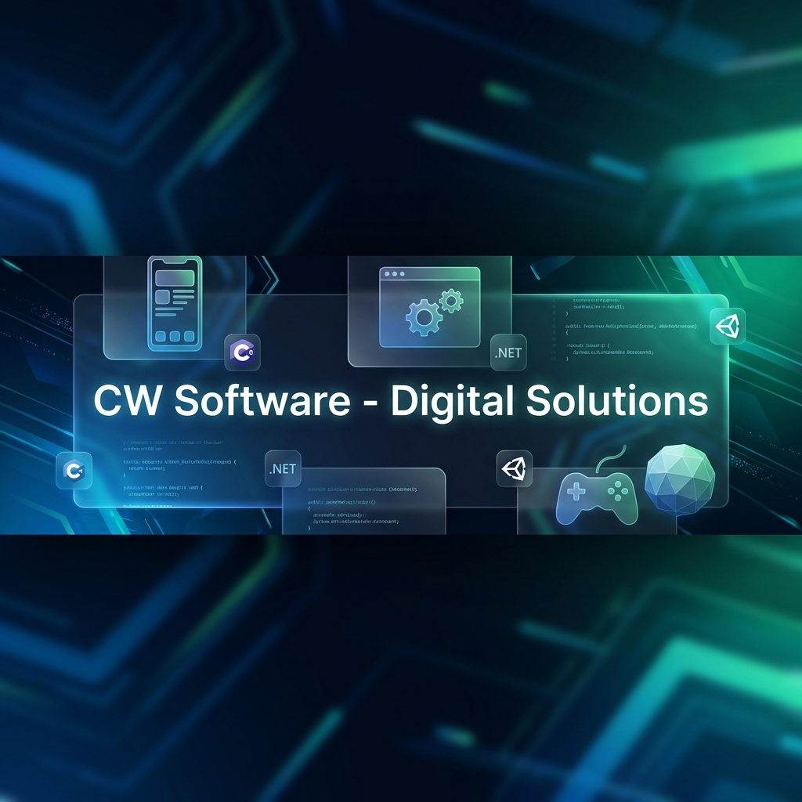
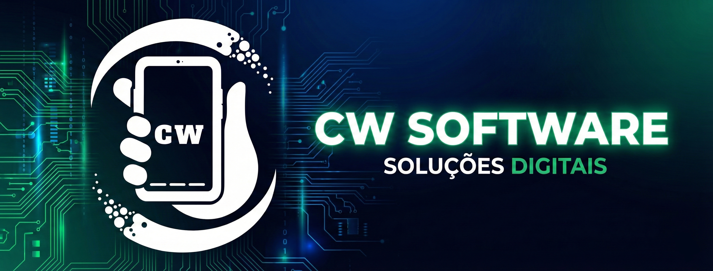
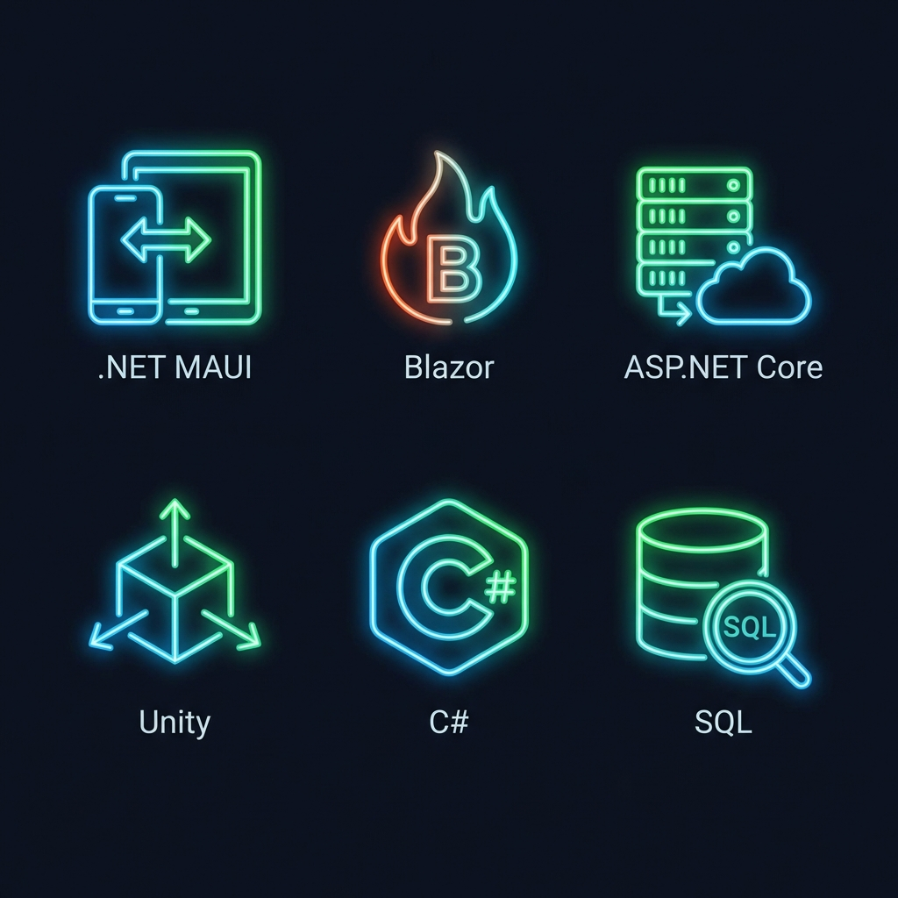
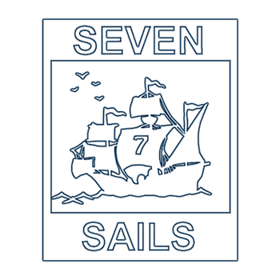

<div align="center">





# 🚀 CW Software - Soluções Digitais

### Transformando Ideias em Realidade Digital

[](https://cwsoftware.com.br)
[](https://dotnet.microsoft.com/)
[](https://dotnet.microsoft.com/apps/aspnet/web-apps/blazor)
[](https://unity.com/)
[](https://cwsoftware.com.br)

**Desenvolvimento de software de alta qualidade com foco em inovação e experiência do usuário**

[🌐 Website](https://cwsoftware.com.br) • [💼 LinkedIn](https://www.linkedin.com/company/cwsoftware-solucoes-digitais/) • [📱 WhatsApp](https://wa.me/5554991205772) • [📧 Contato](mailto:desenvolvimento@cwsoftware.com.br)

</div>

---

## 📖 Sobre Nós

A **CW Software** é uma empresa de desenvolvimento de software especializada em **soluções digitais multiplataforma** usando o ecossistema **Microsoft .NET** e **C#**. Oferecemos desde aplicativos mobile nativos até sistemas web complexos e jogos em Unity.

> 💡 **Nossa Missão**: Criar soluções digitais que combinam **performance**, **design moderno** e **experiência do usuário excepcional**.

### 🎯 O Que Fazemos

- 📱 **Aplicativos Mobile** - Apps nativos para iOS/Android com .NET MAUI
- 🌐 **Sistemas Web** - Aplicações web modernas com Blazor e ASP.NET Core
- 🖥️ **Aplicações Desktop** - Software desktop multiplataforma (Windows, macOS, Linux)
- 🎮 **Game Development** - Jogos 2D/3D com Unity e C#
- ☁️ **Cloud Solutions** - APIs RESTful, microserviços e infraestrutura cloud
- 📦 **Open Source** - Bibliotecas e ferramentas para a comunidade .NET

---

## 🛠️ Stack Tecnológica

<div align="center">



</div>

### Core Technologies

<div align="center">

| Tecnologia | Descrição | Uso |
|------------|-----------|-----|
|  | **C# 12** | Linguagem principal para todos os projetos |
|  | **.NET 10** | Framework multiplataforma |
|  | **.NET MAUI** | Apps mobile nativos (iOS/Android) |
|  | **Blazor Server** | Framework web C# (sem JavaScript) |
|  | **ASP.NET Core** | APIs RESTful e backend |
|  | **Unity 3D** | Game engine para jogos multiplataforma |
|  | **SQL Server / PostgreSQL** | Bancos de dados relacionais |

</div>

---

## 🌟 Projetos em Destaque

### 📱 Papiro - Native HTML to PDF for .NET MAUI

[](https://github.com/CW-Software-Apps/Papiro-MAUI-HtmlToPDF)
[](https://github.com/CW-Software-Apps/Papiro-MAUI-HtmlToPDF)

Biblioteca **leve, gratuita e 100% nativa** para converter HTML em PDF em aplicações .NET MAUI.

**Por que Papiro?**

- ✅ Sem dependências externas ou licenças caras
- ✅ Sem navegadores embarcados pesados
- ✅ Templates HTML simples com placeholders `{{tag}}`
- ✅ Totalmente nativo (iOS e Android)
- ✅ Perfeito para relatórios, faturas e documentos

**Stack:** .NET MAUI • C# • Native iOS/Android APIs

```csharp
// Gere PDFs facilmente!
var html = "<h1>Relatório</h1><p>Cliente: {{nome}}</p>";
var result = await htmlToPdfService.GenerateFromHtmlAsync(html);
```

🔗 **[Ver Repositório](https://github.com/CW-Software-Apps/Papiro-MAUI-HtmlToPDF)**

---

### 📡 MAUI Bluetooth LE Scanner

[](https://github.com/wagenheimer/MAUIBleScanner)
[](https://github.com/wagenheimer/MAUIBleScanner)

Scanner de **Bluetooth Low Energy (BLE)** multiplataforma construído com .NET MAUI e Shiny Framework.

**Features:**

- 🔍 Scan em tempo real de dispositivos BLE
- 📊 Monitoramento de intensidade de sinal com código de cores
- 📱 Display de informações completas (nome, endereço, manufacturer data)
- 🔄 Atualizações ao vivo com timestamps
- 🎯 Performance otimizada com batch processing
- 🚀 UI moderna e responsiva

**Stack:** .NET MAUI • Shiny Framework • Bluetooth LE

🔗 **[Ver Repositório](https://github.com/wagenheimer/MAUIBleScanner)**

---

### 🌐 CW Software Website

[](https://cwsoftware.com.br)
[](https://github.com/CW-Software-Apps/CWSoftwareWebSite)

Website corporativo moderno desenvolvido com **Blazor Server** (.NET 10) e **Tailwind CSS**.

**Características:**

- ✨ Dark theme com gradientes e efeitos glassmorphism
- 🚀 PWA (Progressive Web App) - Instalável como app nativo
- 📱 100% Responsivo (mobile-first)
- 🔍 SEO otimizado (meta tags, Open Graph, Schema.org, sitemap)
- 🎨 Animações AOS (Animate on Scroll)
- ⚡ Performance otimizada com Redis caching

**Stack:** Blazor Server • ASP.NET Core • Tailwind CSS • Redis • Docker

🔗 **[Ver Site ao Vivo](https://cwsoftware.com.br)** | 📂 **[Repositório](https://github.com/CW-Software-Apps/CWSoftwareWebSite)**

---

## 🤝 Parceiros de Game Development

Colaboramos com estúdios de jogos renomados para criar experiências incríveis:

<div align="center">

### Green Sauce Games

[](https://greensaucegames.com)

Estúdio de jogos independente especializado em experiências 2D únicas.

🔗 [greensaucegames.com](https://greensaucegames.com)

---

### Seven Sails Games

[](https://www.sevensails.com.br)

Desenvolvimento de jogos mobile e multiplataforma.

🔗 [sevensails.com.br](https://www.sevensails.com.br)

</div>

---

## 👨‍💻 Sobre o Desenvolvedor

<div align="center">

### Cezar Wagenheimer

**Full Stack Developer | .NET Specialist | Game Developer**

Desenvolvedor apaixonado por criar soluções digitais inovadoras com foco em **performance**, **design** e **experiência do usuário**. Especializado no ecossistema Microsoft .NET e C#, com experiência em desenvolvimento mobile (.NET MAUI), web (Blazor/ASP.NET), desktop e games (Unity).

[](https://www.wagenheimer.com)
[](https://github.com/wagenheimer/)
[](https://www.linkedin.com/in/cezar-wagenheimer/)

</div>

### 🎯 Expertise

```csharp
var expertise = new[] {
    ".NET MAUI (Mobile)",      // iOS/Android native apps
    "Blazor (Web)",            // C# web apps (sem JavaScript)
    "ASP.NET Core (Backend)",  // APIs RESTful e microserviços
    "Unity (Games)",           // 2D/3D game development
    "PostgreSQL / SQL Server", // Database design & optimization
    "Docker & Azure",          // DevOps & Cloud
    "Git & GitHub Actions"     // Version control & CI/CD
};
```

---

## 📊 Estatísticas da Organização

<div align="center">


</div>

---

## 🎨 Filosofia de Design

Nossa abordagem de desenvolvimento combina:

- 🎯 **Performance First** - Código otimizado e eficiente
- 🎨 **Modern UI/UX** - Design contemporâneo e intuitivo
- 📱 **Mobile-First** - Responsividade em todos os dispositivos
- ♿ **Accessibility** - Inclusão e usabilidade para todos
- 🔍 **SEO Optimized** - Visibilidade e performance web
- 🚀 **Continuous Innovation** - Sempre atualizados com as últimas tecnologias
- 🌍 **Open Source First** - Contribuindo para a comunidade

---

## 📞 Entre em Contato

<div align="center">

### 💼 CW Software - Soluções Digitais

🌐 **Website**: [cwsoftware.com.br](https://cwsoftware.com.br)  
📧 **Email**: [desenvolvimento@cwsoftware.com.br](mailto:desenvolvimento@cwsoftware.com.br)  
💼 **LinkedIn**: [CW Software](https://www.linkedin.com/company/cwsoftware-solucoes-digitais/)  
📱 **WhatsApp**: [+55 54 99120-5772](https://wa.me/5554991205772)

---

### 👨‍💻 Cezar Wagenheimer

🌐 **Portfolio**: [wagenheimer.com](https://www.wagenheimer.com)  
💻 **GitHub**: [@wagenheimer](https://github.com/wagenheimer/)  
💼 **LinkedIn**: [Cezar Wagenheimer](https://www.linkedin.com/in/cezar-wagenheimer/)  
📧 **Email**: [cezar@cwsoftware.com.br](mailto:cezar@cwsoftware.com.br)

</div>

---

## 🙏 Agradecimentos

Agradecemos a todos que contribuem para o ecossistema .NET e open-source:

- 💜 [Microsoft .NET Team](https://dotnet.microsoft.com/)
- 🔥 [Blazor Community](https://blazor.net/)
- 📱 [.NET MAUI Community](https://dotnet.microsoft.com/apps/maui)
- 🎮 [Unity Technologies](https://unity.com/)
- 🎨 [Tailwind CSS](https://tailwindcss.com/)

---

<div align="center">

### ⭐ Se você gostou do nosso trabalho, considere dar uma estrela nos nossos projetos

**Desenvolvido com ❤️ por CW Software no Brasil** 🇧🇷

[](https://github.com/CW-Software-Apps)
[](https://github.com/wagenheimer)

---


</div>
